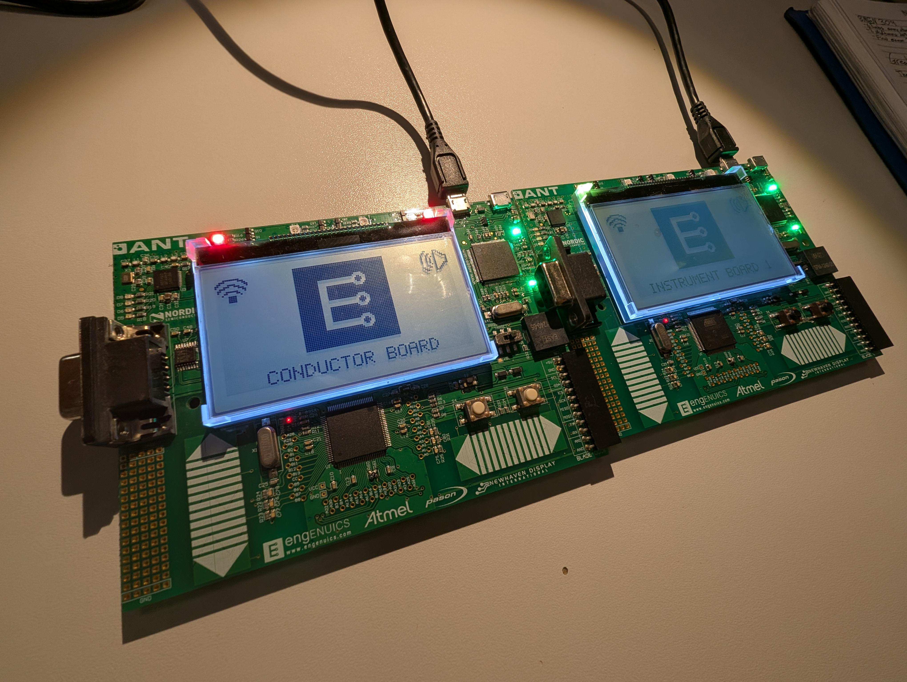
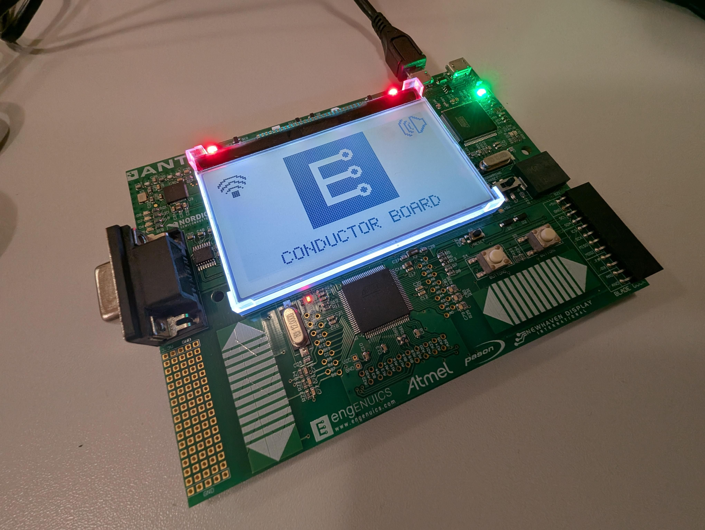
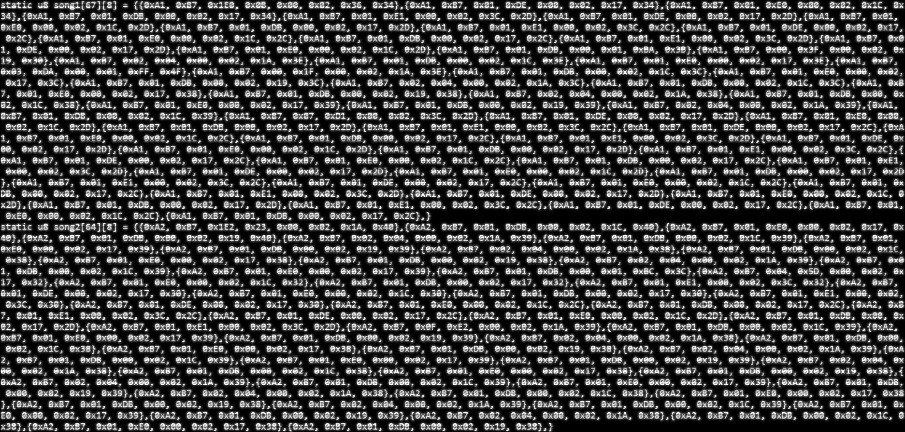

*
 Vikram Procter | March 2025 
*

# Buzzer Orchestra - README

## Project Overview
  
*Photo of finished project*

Syncronous and polyphonic playback of MIDI song tracks on any number of Embedded in Embedded dev boards.

Through the guidance and teaching of the Embedded in Embedded (EiE) club lead by *Jason Long* I was introduced to a SAM3U2 dev board equiped with LCD, LEDs, buzzers, a nRF51422 ANT/BLE 2.4GHz radio, and more. Throughout the year we learned how the hardware of the board works, and wrote the firmware that could utilize this hardware. At the end of the year after learning how the dev board works I created the *Buzzer Orchestra* as my final project.

## How it Works

*Build and run instructions are at the bottom of README.*

The boards work in a similar fashion to how a real orchestra operates. One board is the *Conductor* and all other boards playing are *instruments*, the Conductor provides the music data to each of the instrument boards and provides timing to ensure all boards play syncronously. This Conductor-Intrumentalist dyad aligns with how the ANT radio protocol works, for ANT radio communications one board is the Master and all other boards are Slaves. In my case the Conductor board is configured as the radio Master and all intrument boards are configured as radio Slaves. 

Each board type has its own functionality regarding both radio communications and audio playback. We will look at how each board functions.

### Conductor-Instrument Board Dyad
The Conductor board starts radio communications by opening the channel and waiting for instrument boards to pair. Once instrument boards have paired, upon a button press, the conductor board will start providing music data to the Instrument boards via 8-byte radio packets (the topolgy of the packets is described later). Music data is sent sequentially and in full before play back can begin, this means the first instrument board will receive all music data for the current song before the next instrument board its provided its music information. 

Once all Instrument boards have been *given the music* the conductor board send an intialization and start playback message. This message signals to all boards to begin playback. Radio communications and response are on the order of <1ms so little must be done to ensure all boards start at the same time as human audio preseption can only detect descrepancy at a resoultion of about 6ms. Both the Instrument boards and the Conductor board preform music playback.

### Radio Communication

The Conductor board acting as the Master of the radio communication broadcasts data packets to all boards. In order for the correct Instrument board to receive the correct music data packets contain a instrument ID, if a broad cast is received from the Conductor board Instrument boards will check to see if the instrument ID matches its internal ID, if so it will store that data, otherwise it ignores it as the data was meant for another board. 

When sending packets often packets are lost (or dropped) to ensure that all the music data is received properly each radio packet is acknowledged by the Instrument board if the acknowldegment is not received by the Conductor the packet will be sent again.

### Music Data and Playback

Music data is from MIDI files, I wrote a MIDI intrerperter in python to provide the MIDI data in a form more usable for the EiE dev board buzzers. The python script also preformed the packet assembly and embedded the instrument IDs depending on inputs to the program.

Once all boards have received the required data for music playback the Conductor sends out a *start song* message to signal the song will start now. Each board works through their music data by setting the frequency of the buzzer and waits for the durration specifed by each note. 

Note data is received in the note pitch index set by the MIDI standard, to convert from this index to a frequency the following formula is used: 

$f=440\cdot2^{(n-69)/12}$

This was precalculated using a python script and durring playback the frequencies were found in the lookup table array.

### Radio Packet
**8-Byte Radio Packet**
| \[Byte7\]     | \[Byte6\]     | \[Byte5-3\] | \[Byte2-0\] |
| :-----------: | :-----------: | :---------: | :---------: |
| Instrument ID | Project ID    |   Note 2    | Note 1      | 

**Note Structure**
| \[Byte2\]     | \[Byte1-0\]    |
| :-----------: | :------------: |
| Note Pitch    | Note Durration |

**Instrument ID:** One byte ID that allows for up to 255 instrument boards  
**Project ID:** Static byte to distinguish radio packets sent from conductor from other peoples boards.   
**Note Pitch:** Dirrect MIDI pitch value, converted to frequency durring playback.  
**Note Durration:** 2-byte value allowing for 1ms accuracy and note durrations maximums that are longer than a minute.

## Build and Run Instructions

To compile the project | *Note: waf requires python*

1. Open a new terminal
2. Run `./waf configure --board=<hardware>` replacing `<hardware>` with either `ASCII` or `DOT_MATRIX` depending on the board you have. This step should only need to be run once if successful.
3. Run `./waf build` to build or `./waf build -F` to build and flash the device.

Learn more at the [Embedded in Embedded website](https://embeddedinembedded.com/)